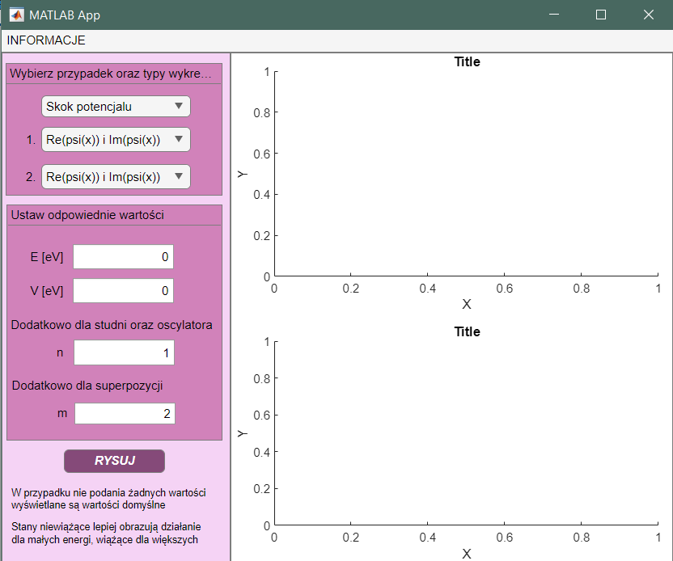
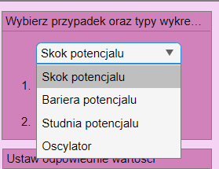
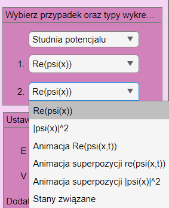
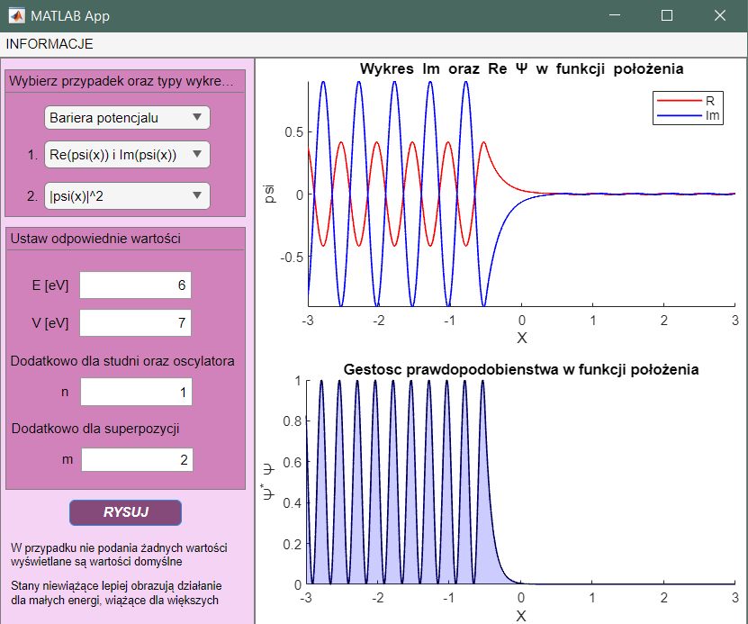
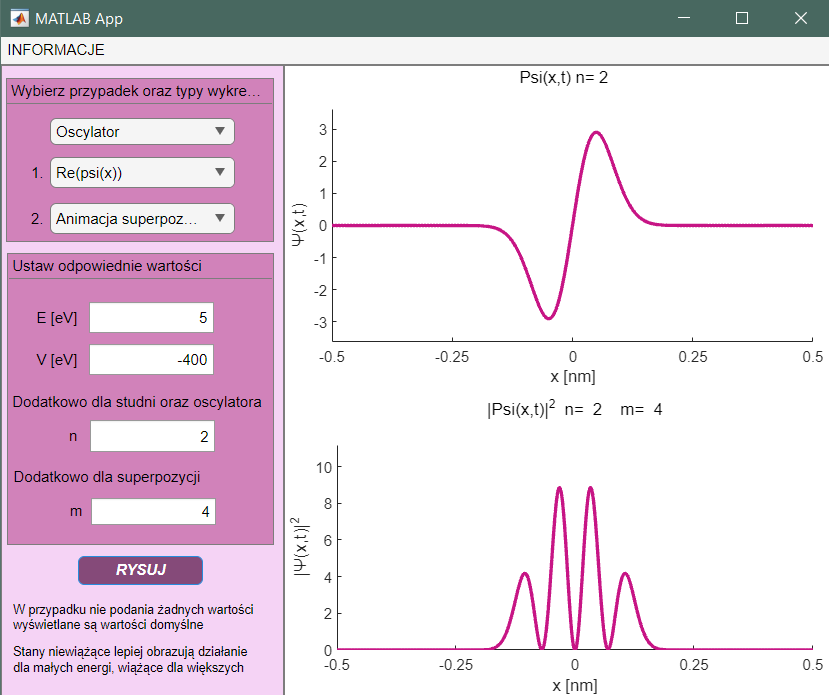
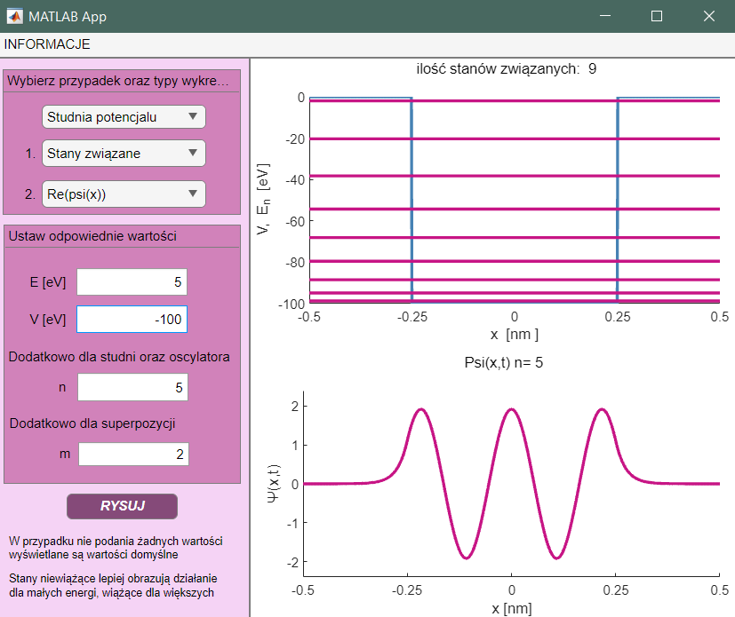
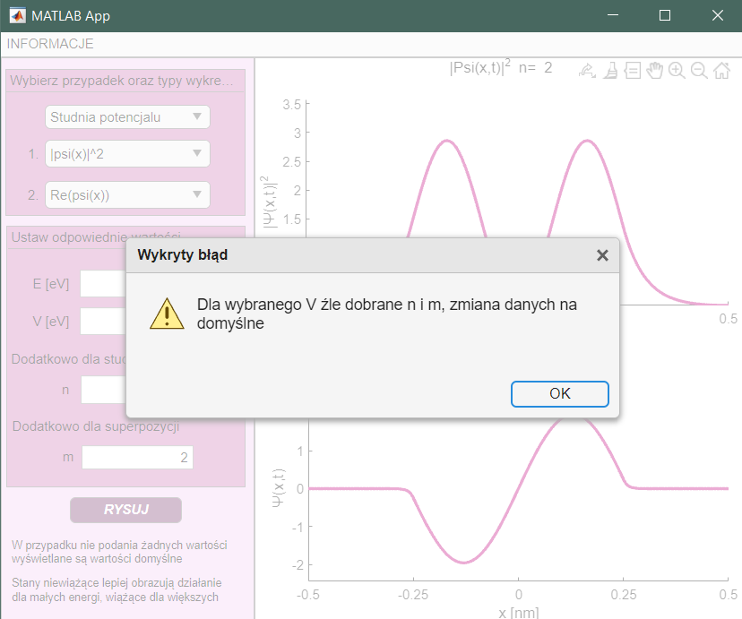
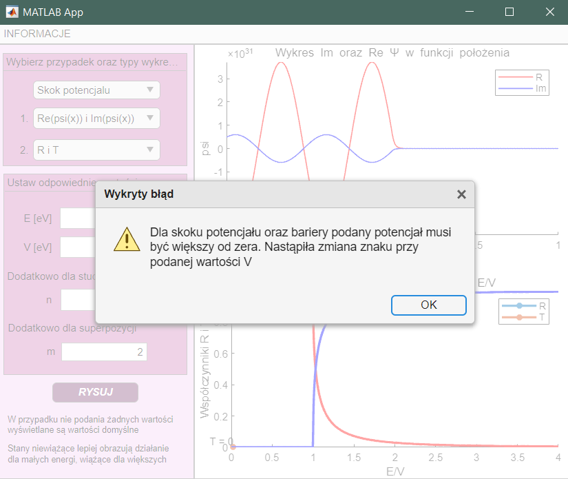

## Quantum Solver – A MATLAB App for Solving the Schrödinger Equation

**Quantum Solver** is an interactive MATLAB application for numerically solving the one-dimensional Schrödinger equation using the **Finite Difference Method (FDM)**.

The app allows users to explore quantum mechanical behaviors under different potential profiles, visualize wavefunctions and probability densities, and even observe quantum animations such as superpositions and time evolution.

---

## Features

- Supports four quantum scenarios:
  - 🔹 **Potential Step**
  - 🔹 **Finite Potential Barrier**
  - 🔹 **Finite Potential Well**
  - 🔹 **Quantum Harmonic Oscillator**
- Choose from **default parameters** or manually enter your own (Energy *E*, Potential *V*, state index *n*, superposition index *m*)
- **Automatic correction of non-physical inputs** with appropriate warnings (e.g. negative potentials, incorrect state indices)
- Two customizable plotting panels with options such as:
  - ✅ Real(ψ), Imag(ψ), |ψ|²
  - ✅ Time-dependent animations (Re(ψ(x,t)), |ψ(x,t)|²)
  - ✅ Bound state visualization and energy levels
  - ✅ Reflection and transmission coefficients (*R* and *T*) for scattering states

---

## Interface Overview

  

---

##  Input and Plot Selection

  
  

---

## Example Scenarios

### 🔸 Potential Barier

  

---

### 🔸 Harmonic Oscillator with Superposition Animation

  

---

### 🔸 Potential Well with Bound States

  

---

##  Error Handling

The app automatically detects and adjusts invalid input values, informing the user through clear pop-ups:

- Invalid quantum numbers `n`, `m`:
  
  

    
  

- Negative or zero potential for steps/barriers:

  

    
  

---

## Authors

Project developed collaboratively by:

- **Wiktoria Maksymiak**:  
  Modules: `calka.m`, `potencjal.m`, `psi_zwiazane.m`, `psit_zwiazane.m`, `psi_niezwiazane.m`, `superpozycja.m`

- **Ewelina Borkowska**:  
  Modules: `calculatePsiX.m`, `psix_bariera.m`

> **Note:** All core logic and GUI functionality were implemented jointly.

---

## Tips

- If no parameters are provided, the app uses **default values**
- **Unbound states** (e.g., scattering) are best analyzed for low energies
- For wells and oscillators, parameters `n` and `m` control:
  - `n` – the bound state number
  - `m` – number of states used in the wavefunction superposition

---

## Use Cases

- Educational quantum mechanics demonstrations
- Numerical analysis of 1D quantum systems
- Visualization of tunneling, interference, and energy quantization

---

📌 **Requirements**: MATLAB + App Designer  
📌 **Interface Language**: Polish  
📌 **Numerical Method**: Finite Difference Method (FDM)

